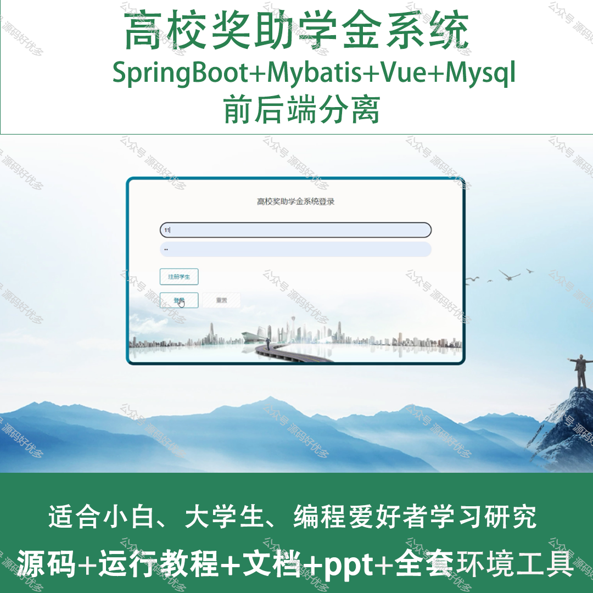
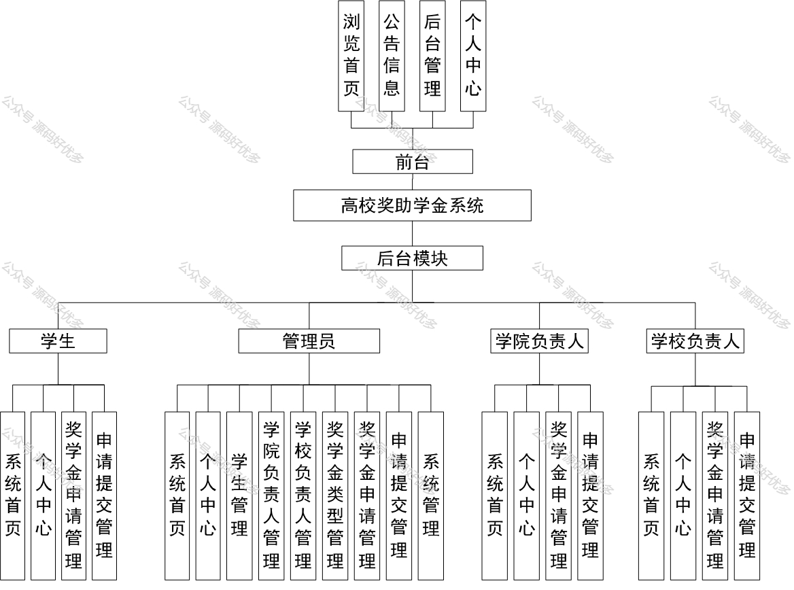
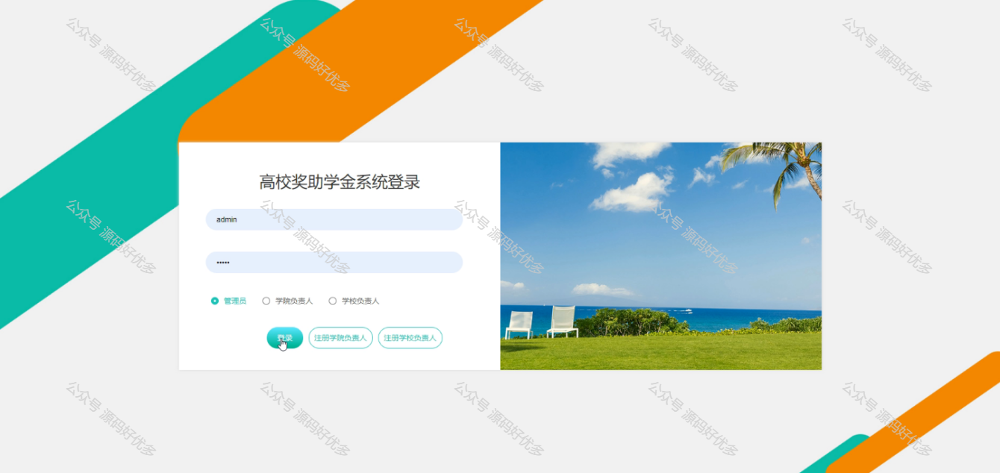
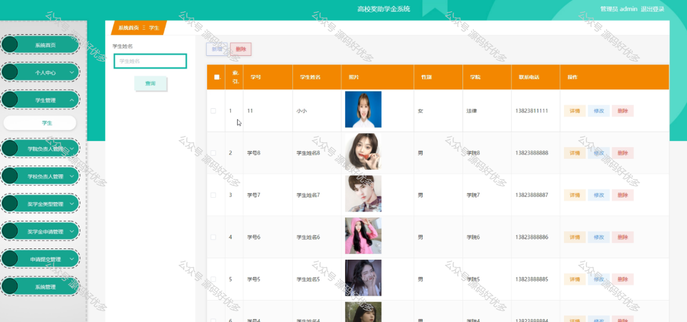
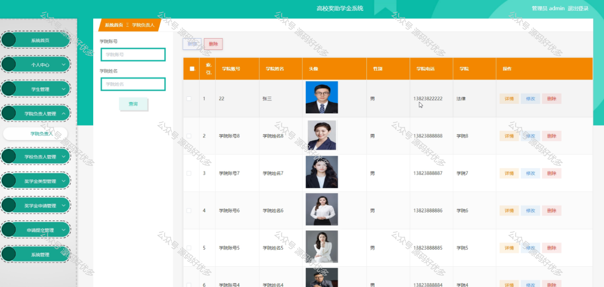
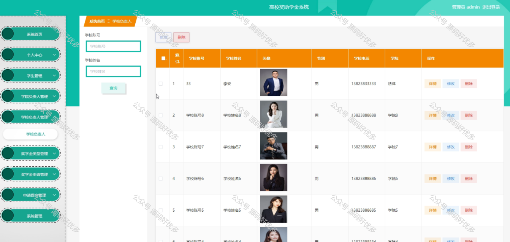
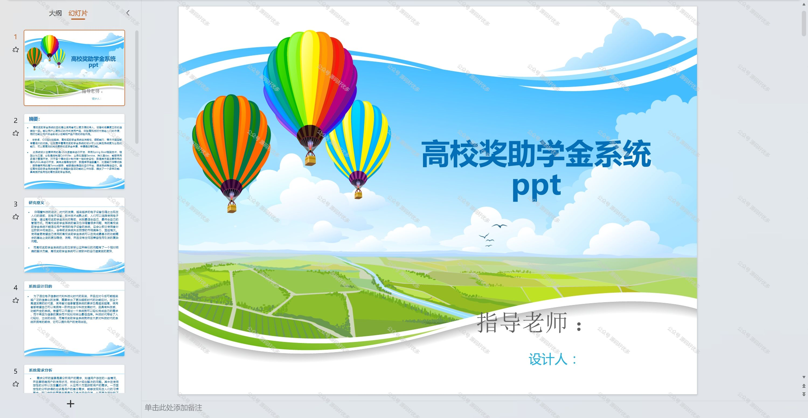
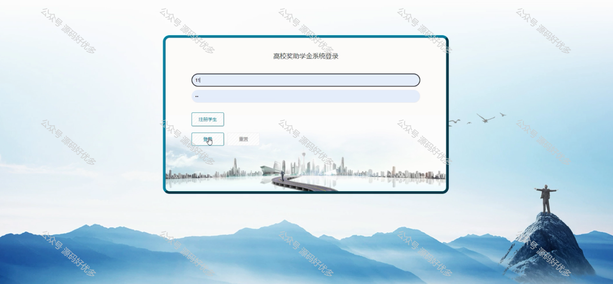
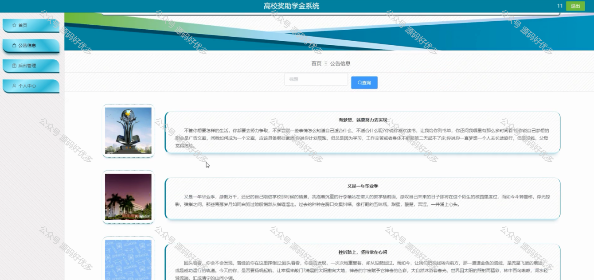
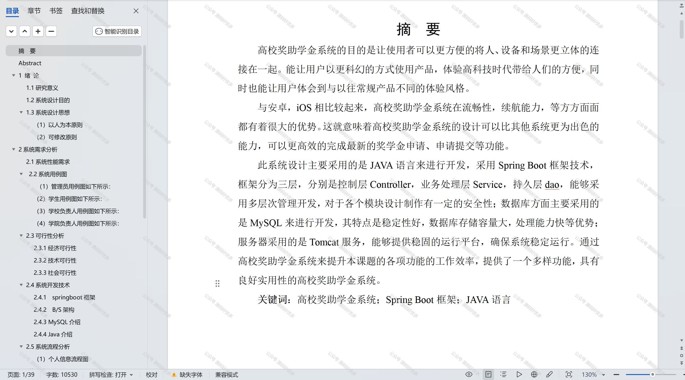

 
## 查看主页获取源码

### 一、作品包含

源码+数据库+设计文档万字+PPT+全套环境和工具资源+部署教程

### 二、项目技术

前端技术：Html、Css、Js、Vue、Element-ui

数据库：MySQL

后端技术：Java、Spring Boot、MyBatis

  

### 三、运行环境

开发工具：IDEA/eclipse

数据库：MySQL5.7

数据库管理工具：Navicat10以上版本

环境配置软件： JDK1.8+Maven3.6.3

前端Nodejs：14

### 四、项目介绍
项目编号：springbootA164

高校奖助学金系统的背景在于响应国家对教育公平的重视，以及满足高校对学生资助工作的精细化管理需求。随着教育事业的快速发展，奖助学金的覆盖范围和种类日益增多，传统的手工管理方式已无法高效、公正地处理大量奖助学金申请和发放工作。因此，构建一套集成化、智能化的奖助学金系统，对于提升资助工作的透明度、确保资金精准发放、激励学生勤奋学习具有重要意义。

前台学生功能：浏览首页、公告信息、后台管理、个人中心。

后台分为管理员、学生、学院负责人、学校负责人
管理员的功能：系统首页、个人中心、学生管理、学院负责人管理、学校负责人管理、奖学金类型管理、奖学金申请管理、申请提交管理、系统管理。
学生的功能：系统首页、个人中心、奖学金申请管理、申请提交管理。
学院负责人的功能：系统首页、个人中心、奖学金申请管理、申请提交管理。
学校负责人的功能：系统首页、个人中心、奖学金申请管理、申请提交管理。

### 五、运行截图

  
